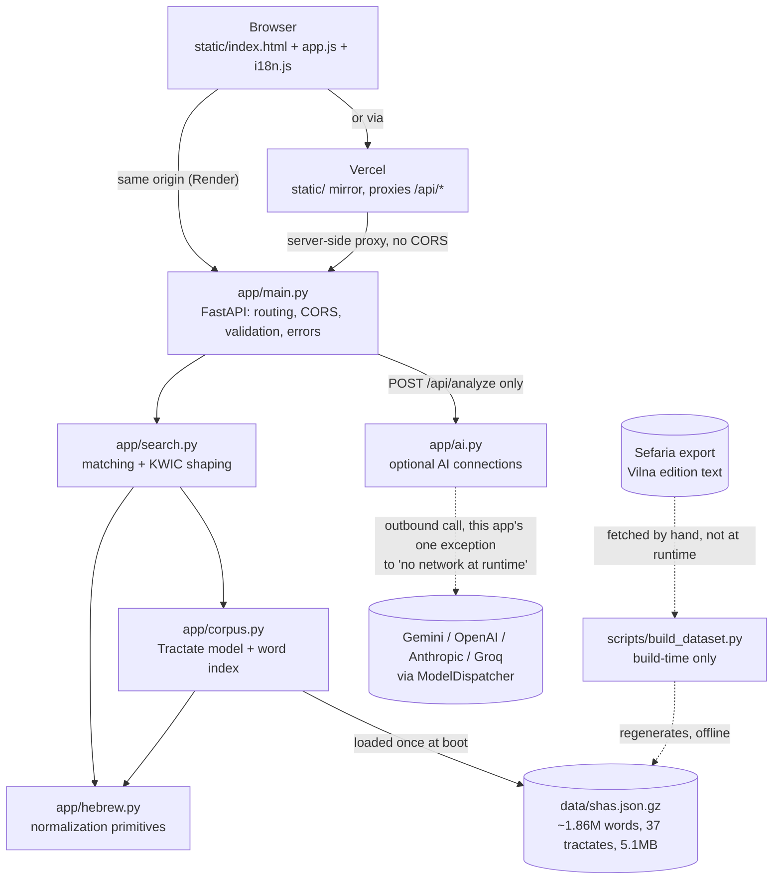

# High-level design — Shas Radar

What the system is, why it is shaped this way, and how a request flows
through it. Per-function detail is in [`LLD.md`](LLD.md); the file-by-file
map is in [`STRUCTURE.md`](STRUCTURE.md).

## Requirements

**Functional.** Given a Hebrew/Aramaic word, name, or phrase (up to 5,
comma/semicolon-separated, OR'd together), find every occurrence across all
37 tractates of the Babylonian Talmud and return it as KWIC (Keyword-In-
Context): a configurable window of words before and after the match, plus
the full surrounding paragraph on demand. A query matches three ways —
exact, with a Hebrew/Aramaic clitic prefix attached to the matched word, and
exact phrase (with the same prefix allowance on the phrase's first word
only). Every result carries an authoritative citation (tractate, daf, amud)
and a Sefaria deep link. A bonus proximity search finds two words within N
tokens of each other. An optional AI feature ("find connections") looks for
what links a set of results the visitor has selected.

**Non-functional.**

- *No runtime network access for search.* The corpus (~1.86M words, all 37
  tractates) ships in the repository, so search itself has no upstream to be
  slow, rate-limited, or down. The one exception is the optional AI
  connections feature — see **Dynamic view**.
- *Cold start pays once.* Loading and indexing ~1.86M tokens runs at boot,
  not on the first visitor's search.
- *Memory-bounded.* The naive representation of the corpus (plain Python
  lists) overran a 512MB deploy target before the server even finished
  starting. `app/corpus.py` trades that for string interning and packed
  `array.array` columns — see **Data storage**.
- *Installable, not offline.* The PWA shell lets a phone add the app to its
  home screen and paints instantly from the cached shell, but every search
  is still a live API call — there is no offline corpus on the client.
- *A CDN has nothing to wake.* The same `static/` directory is deployed
  twice (Render, alongside the API, and Vercel, standalone) so the page
  paints immediately on a cold Render instance instead of showing a blank
  screen for up to a minute. See **Dynamic view**.

## Static view



The dotted edges are deliberate: `build_dataset.py` is run by a maintainer
to regenerate the corpus and is never invoked by the service, and the AI
vendor call happens only inside `POST /api/analyze` — every other route
never leaves the process.

Module boundaries run one way — `main` → `search`/`ai` → `corpus` →
`hebrew` — and nothing calls back upward. `hebrew.py` is pure string
manipulation with no knowledge of the corpus or HTTP.

## Dynamic view

```mermaid
sequenceDiagram
    participant B as Browser
    participant V as Vercel (static mirror)
    participant M as main.py (Render)
    participant S as search.py
    participant C as Corpus (in memory)
    participant A as ai.py
    participant Vend as AI vendor (optional)

    B->>V: GET / (page paints immediately, nothing to wake)
    B->>V: GET /api/health (fires on load, starts waking Render)
    V->>M: proxied server-side -- same-origin from the browser's view
    Note over M: cold start: up to ~1 minute on Render's free tier
    B->>V: GET /api/search?q=...&before=&after=&limit=
    V->>M: retried with backoff for up to ~90s if the edge drops it
    M->>M: parse_queries() -- split on separators, validate Hebrew, cap at 5
    alt invalid
        M-->>B: 4xx {"error": "<hebrew>", "code": "<stable>"}
    else valid
        M->>S: search(corpus, queries, before, after, limit, tractate, offset)
        loop each query
            S->>C: by_word lookups (exact, with-prefix, phrase)
            C-->>S: token positions
            S->>S: serialize_match() -- KWIC window, citation, Sefaria link
        end
        S-->>M: {before, after, groups: [...]}
        M-->>B: 200 JSON
    end
    opt visitor checks >=2 results and asks for connections
        B->>V: POST /api/analyze {groups, locale, credentials, history?}
        V->>M: proxied
        Note over B: history is empty on this first call; a follow-up<br/>question in the "continue chatting" dialog resends<br/>the whole exchange so far as history, same endpoint
        M->>A: analyze_connections(groups, locale, credentials, history)
        A->>A: build registry from server + BYOK credentials
        alt no credential anywhere
            A-->>M: NoCredentialError
            M-->>B: 400 no_credential
        else
            A->>Vend: dispatch, bounded to AI_REQUEST_DEADLINE_SECONDS
            Vend-->>A: completion
            A-->>M: AnalyzeResult
            M-->>B: 200 {connection, provider}
        end
    end
```

Matching never scans the whole ~1.86M-token corpus for the common cases:
`Tractate.build_index()` builds `by_word` (normalized word → positions), so
exact-word lookups are dict hits. The attached-prefix modes (`find_with_
prefix`, `find_phrase_with_prefix`) scan each tractate's distinct vocabulary
instead — tens of thousands of words, not the token stream — measured at
~18ms across the whole corpus.

The Render-cold-start problem is why the frontend is deployed twice rather
than once: served only from Render, the *page itself* would wait on the
wake, showing a blank screen. Served from Vercel, the page paints while its
own first API call starts Render waking in the background.

## Data storage

There is no database, cache, or blob store. The single store is
`data/shas.json.gz` (~5.1 MB, all 37 tractates), decompressed and indexed
into process memory at startup by `load_corpus()`, `functools.lru_cache`d to
one entry so every request shares the same instance.

In memory, `Tractate` trades the naive representation (four plain Python
lists per tractate) for two things, both keyed off the fact that a token
stream is highly repetitive (fewer than 7% of normalized forms are
distinct):

- `sys.intern()` on every token string, so ~1.86M entries collapse to
  sharing far fewer actual string objects.
- `array.array` instead of a plain list for the purely-numeric per-token
  columns (`token_daf`, `token_amud`, and word positions in `by_word`),
  trading a Python object + pointer per entry for a few raw bytes.

Together this holds the corpus in a bit over a third of the naive memory
footprint — the difference between fitting a 512MB deploy target and not.

The data is immutable and versioned by the `source`/`license` fields inside
the file itself, reported by `/api/health`. Backup and DR are therefore the
git repository: the corpus is a tracked artifact, and recovering the
service is redeploying the image.

## Configuration and secrets

Search itself needs no configuration beyond `$PORT` (supplied by the
platform) and `ALLOWED_ORIGINS` (the CORS allowlist — a plain list of
hostnames, not a secret). The optional AI feature reads, if set:
`GEMINI_API_KEY` / `OPENAI_API_KEY` / `ANTHROPIC_API_KEY` / `GROQ_API_KEY`
(any subset), their `*_MODEL` overrides, `AI_REQUEST_DEADLINE_SECONDS`, and
the `AI_REQUESTS_PER_MIN` / `AI_TOKENS_PER_MIN` / `AI_TOKENS_PER_DAY` quota
knobs. A fresh clone with none of these set still runs the whole app; the
one endpoint that needs a key answers a clean `400 no_credential` instead of
crashing. A visitor's own AI key ("bring your own key") travels in the
request body, never as server configuration, and is never persisted or
logged — see [`README.md`](../README.md#bring-your-own-key-per-visitor).

## Validation at the edge

All request validation happens in `main.py` before any search or AI call
runs, and every rejection carries a stable machine-readable `code` alongside
a Hebrew message, because the frontend keys its translated error text off
that code:

| Condition | Code |
| --- | --- |
| Empty or whitespace-only query | `empty` |
| No Hebrew letters in a query | `invalid_query` |
| More than `MAX_QUERIES` (5) | `too_many` |
| `/api/analyze` with no usable AI credential anywhere | `no_credential` |
| `/api/analyze` dispatch exceeding the deadline | `timeout` |

`before`/`after`/`limit`/`offset` are clamped (not rejected) to their
allowed ranges inside `search()`, so a caller passing anything gets a sane
result back rather than a 4xx.

## Integration-test strategy

`tests/test_search.py` and `tests/test_hebrew.py` run against the real
committed corpus rather than a fixture — the point of most of them is that
the actual Talmud gives the expected answer. `tests/test_ai.py` drives
`app/ai.py` through ModelDispatcher's own keyless `MockProvider`, so the
suite never makes a real network call or needs an API key; see
[`LLD.md`](LLD.md#test-plan) for the full breakdown. CI enforces a 95%
coverage floor, set just under the measured ~97% so it ratchets rather than
fails on arrival.
